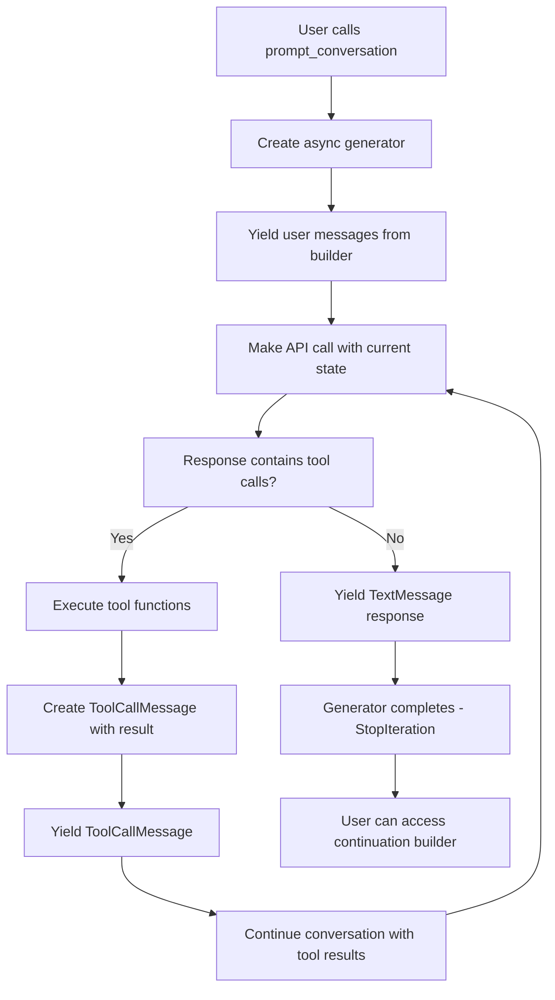

# Design Document

## Overview

This design refactors the existing conversation handling in the fluent LLM library to use an async generator pattern. The new approach provides a more intuitive and Pythonic way to handle multi-turn conversations with tool calling, where each yield returns individual messages, allowing for fine-grained control over conversation flow.

The key changes include:
1. Converting `prompt_conversation()` to return an async generator instead of a tuple
2. Removing the text message parameter from `prompt_conversation()`
3. Combining tool calls, execution, and results into single `ToolCallMessage` instances
4. Maintaining `prompt_agentically()` for automatic processing scenarios

## Architecture

### Core Design Changes

1. **Async Generator Pattern**
   - `prompt_conversation()` returns an async generator that yields individual messages
   - Each yield represents one step in the conversation (tool call, AI response)
   - Generator maintains internal state for conversation continuation

2. **Unified Tool Call Messages**
   - `ToolCallMessage` now contains tool call, execution, and result in one object
   - Eliminates separate `ToolResultMessage` instances
   - Simplifies message handling and reduces complexity

3. **Clean API Separation**
   - `prompt_conversation()` for manual iteration (async generator)
   - `prompt_agentically()` for automatic processing (tuple return)
   - Different names reflect different return types and usage patterns

### Data Flow



## Components and Interfaces

### Enhanced ToolCallMessage

```python
@dataclass
class ToolCallMessage(Message):
    """Message representing a complete tool call with execution result."""
    message: str  # Any assistant message text accompanying the tool call
    tool_name: str
    tool_call_id: str
    arguments: dict
    result: Any | None = None  # Tool execution result (when successful)
    error: Exception | None = None  # Exception instance (when failed)
    role: MessageRole = MessageRole.ASSISTANT
    
    def __str__(self) -> str:
        """String representation showing tool call and result."""
        if self.error:
            return f"Tool call: {self.tool_name}({self.arguments}) -> ERROR: {self.error}"
        return f"Tool call: {self.tool_name}({self.arguments}) -> {self.result}"
```

### Refactored Builder Methods

```python
class LLMPromptBuilder:
    async def prompt_conversation(self, **kwargs) -> AsyncGenerator[Message, None]:
        """Execute conversation with tool calling support using async generator.
        
        Yields individual messages as the conversation progresses. Each yield
        represents one step: user messages, tool calls with results, or AI responses.
        
        Args:
            **kwargs: Additional arguments passed to the provider API
        
        Yields:
            Message: Individual messages (TextMessage, ToolCallMessage, etc.)
            
        Returns:
            AsyncGenerator that yields messages and provides continuation via .asend()
            
        Example:
            ```python
            conversation = llm.agent("...").request("...").prompt_conversation()
            
            # Manual iteration
            response1 = await conversation.__anext__()  # or yield conversation
            response2 = await conversation.__anext__()
            
            # For loop iteration  
            async for message in conversation:
                print(f"Received: {message}")
                
            # Access continuation builder after completion
            try:
                await conversation.__anext__()
            except StopAsyncIteration as e:
                continuation_builder = e.value
            ```
        """
        
    async def prompt_agentically(self, max_calls: int, **kwargs) -> Tuple[List[Message], "LLMPromptBuilder"]:
        """Execute conversation with automatic tool calling up to max_calls.
        
        Similar to the old prompt_conversation behavior - automatically processes
        all tool calls and returns the complete message list and continuation.
        
        Args:
            max_calls: Maximum number of API calls to prevent infinite loops
            **kwargs: Additional arguments passed to the provider API
        
        Returns:
            Tuple of (complete_message_list, continuation_builder)
        """
```

### Async Generator Implementation

The async generator will be implemented as a method that maintains conversation state and yields messages as they are processed:

```python
async def prompt_conversation(self, **kwargs) -> AsyncGenerator[Message, None]:
    """Async generator implementation for conversation handling."""
    
    # Initialize conversation state (includes builder messages)
    conversation_state = self._get_or_create_conversation_state()
    
    # Main conversation loop
    while True:
        # Build prompt and make API call
        p = Prompt(
            messages=MessageList(conversation_state.message_history),
            expect_type=ResponseType.TEXT,
            preferred_provider=self._preferred_provider,
            preferred_model=self._preferred_model,
            tools=self._tools,
            is_conversation=True,
        )
        
        provider, model = self._model_selector.select_model(p)
        
        # Make API call
        response = await provider.prompt_via_api(
            model=model, 
            p=p, 
            conversation_state=conversation_state,
            **kwargs
        )
        
        # Process response
        if hasattr(response, 'tool_calls') and response.tool_calls:
            # Handle tool calls
            for tool_call in response.tool_calls:
                # Execute tool
                result, error = self._execute_tool_call(tool_call.name, tool_call.arguments)
                
                # Create unified tool call message
                tool_message = ToolCallMessage(
                    message=response.text or "",
                    tool_name=tool_call.name,
                    tool_call_id=tool_call.id,
                    arguments=tool_call.arguments,
                    result=result,
                    error=error
                )
                
                conversation_state.message_history.append(tool_message)
                yield tool_message
                
            # Continue conversation with tool results
            continue
        else:
            # Regular text response - end of conversation
            text_message = TextMessage(text=response.text, role=Role.ASSISTANT)
            conversation_state.message_history.append(text_message)
            yield text_message
            
            # Return continuation builder via StopAsyncIteration
            continuation_builder = self._copy()
            continuation_builder._conversation_state = conversation_state
            return continuation_builder
```

## Data Models

### Message Type Hierarchy

The existing message hierarchy is enhanced with the unified `ToolCallMessage`:

```python
# Existing messages remain unchanged
@dataclass
class TextMessage(Message):
    text: str
    role: MessageRole = MessageRole.USER

@dataclass  
class AgentMessage(Message):
    text: str
    role: MessageRole = MessageRole.SYSTEM

# Enhanced tool call message (replaces separate tool call + result)
@dataclass
class ToolCallMessage(Message):
    """Unified message containing tool call and execution result."""
    message: str  # Assistant message text (if any)
    tool_name: str
    tool_call_id: str
    arguments: dict
    result: Any | None = None  # Successful execution result
    error: Exception | None = None  # Exception if execution failed
    role: MessageRole = MessageRole.ASSISTANT
    
    def to_dict(self) -> dict:
        """Convert to provider API format."""
        # Implementation depends on provider format
        pass

# Remove ToolResultMessage - functionality merged into ToolCallMessage
```

### Conversation State Management

The conversation state structure remains similar but is enhanced for generator support:

```python
@dataclass
class ConversationState:
    """Internal conversation state for async generator conversations."""
    message_history: MessageList  # Our abstract message format
    internal_session: list[dict]  # Provider-specific format
    tools: list[Tool]
    current_step: int = 0  # Track conversation progress
    
    def add_message(self, message: Message) -> None:
        """Add message to both abstract and internal formats."""
        self.message_history.append(message)
        self.internal_session.append(message.to_dict())
```

## Error Handling

### Generator Error Handling

```python
async def prompt_conversation(self, **kwargs) -> AsyncGenerator[Message, None]:
    try:
        # Generator implementation
        yield from self._conversation_generator(**kwargs)
    except Exception as e:
        # Wrap provider errors with conversation context
        raise RuntimeError(f"Error in conversation generator: {str(e)}") from e
    finally:
        # Cleanup conversation state if needed
        pass
```

### Tool Execution Errors

Tool execution errors are captured in the `ToolCallMessage.result` field:

```python
def _execute_tool_call(self, tool_name: str, arguments: dict) -> tuple[Any | None, Exception | None]:
    """Execute tool call and return (result, error) tuple."""
    try:
        tool = self._find_tool(tool_name)
        result = tool.function(**arguments)
        return result, None
    except Exception as e:
        return None, e
```

### Async Generator Protocol Compliance

The implementation follows Python's async generator protocol:

- Properly raises `StopAsyncIteration` when complete
- Supports `async for` iteration
- Handles exceptions within the generator context
- Provides proper cleanup via `finally` blocks

## Testing Strategy

### Core Async Generator Tests

```python
async def test_async_generator_iteration():
    """Test manual async generator iteration."""
    
    def get_weather(location: str) -> str:
        return f"Weather in {location}: Sunny, 72°F"
    
    conversation = llm \
        .agent("You are a helpful assistant") \
        .tool(get_weather) \
        .request("What's the weather in Paris?") \
        .prompt_conversation()
    
    # Manual iteration
    messages = []
    try:
        while True:
            message = await conversation.__anext__()
            messages.append(message)
    except StopAsyncIteration as e:
        continuation_builder = e.value
    
    # Verify message types and content
    assert len(messages) >= 2  # At least user message and tool call
    assert any(isinstance(msg, ToolCallMessage) for msg in messages)
    assert continuation_builder is not None

async def test_async_for_loop_iteration():
    """Test async for loop iteration."""
    
    def get_weather(location: str) -> str:
        return f"Weather in {location}: Sunny, 72°F"
    
    conversation = llm \
        .agent("You are a helpful assistant") \
        .tool(get_weather) \
        .request("What's the weather in Paris?") \
        .prompt_conversation()
    
    messages = []
    async for message in conversation:
        messages.append(message)
        
    # Verify expected message flow
    assert len(messages) >= 2
    assert any(isinstance(msg, ToolCallMessage) for msg in messages)

async def test_tool_call_message_structure():
    """Test that ToolCallMessage contains complete information."""
    
    def calculate(x: int, y: int) -> int:
        return x + y
    
    conversation = llm \
        .agent("You are a calculator") \
        .tool(calculate) \
        .request("What is 5 + 3?") \
        .prompt_conversation()
    
    tool_message = None
    async for message in conversation:
        if isinstance(message, ToolCallMessage):
            tool_message = message
            break
    
    assert tool_message is not None
    assert tool_message.tool_name == "calculate"
    assert tool_message.arguments == {"x": 5, "y": 3}
    assert tool_message.result == 8
    assert hasattr(tool_message, 'message')  # Assistant text
```

### Compatibility Tests

```python
async def test_prompt_agentically_compatibility():
    """Test that prompt_agentically still works as expected."""
    
    def get_weather(location: str) -> str:
        return f"Weather in {location}: Sunny, 72°F"
    
    messages, continuation = await llm \
        .agent("You are a helpful assistant") \
        .tool(get_weather) \
        .request("What's the weather in Paris?") \
        .prompt_agentically(max_calls=5)
    
    # Should return complete conversation
    assert len(messages) >= 2
    assert any(isinstance(msg, ToolCallMessage) for msg in messages)
    assert isinstance(continuation, LLMPromptBuilder)

async def test_no_message_parameter_error():
    """Test that prompt_conversation doesn't accept message parameter."""
    
    with pytest.raises(TypeError):
        # This should fail - no message parameter allowed
        conversation = llm.agent("test").prompt_conversation("Hello")
```

## Implementation Notes

### Python Async Generator Best Practices

1. **Proper Exception Handling**: Use try/finally blocks for cleanup
2. **StopAsyncIteration**: Return continuation builder via exception value
3. **State Management**: Maintain conversation state across yields
4. **Memory Management**: Clean up resources when generator completes

### Provider Integration

The async generator approach requires minimal changes to existing provider code:

- Providers continue to return response objects
- Generator handles tool call detection and execution
- Provider-specific message formatting remains unchanged

### Backward Compatibility

- Existing `prompt_agentically()` method maintains old behavior
- New `prompt_conversation()` signature is clearly different (no message parameter)
- Clear migration path from old to new API

### Performance Considerations

- Generator maintains minimal state between yields
- Tool execution happens synchronously within async context
- Memory usage is optimized by yielding messages individually
- Conversation state is preserved efficiently across iterations